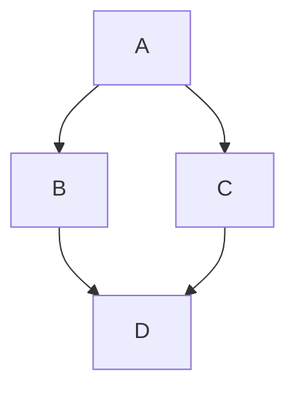

# Nome do Repositório

**Título do TCC:** Avaliação comparativa de modelos de linguagem open-weight executados localmente na tarefa de análise de sentimentos em português brasileiro
**Alunos:** Matheus Rodrigues Rodrigues
**Semestre de Defesa:** 2026-1

[PDF do TCC](caminho_do_arquivo)


# TL;DR

<!-- Resumo super conciso para quem não quer ler o README e começar a executar o código -->
Para rodar:
```$ pm2 start ecosystem.config.js```


# Descrição Geral
<!-- Resumo do TCC -->


# Funcionalidades
<!-- Descreva as principais funcionalidades do seu código. Exemplo: -->
* Funcionalidade principal 1
   * detalhe a
   * detalhe b
   * detalhe c
* Funcionalidade principal 2
   * detalhe d
   * detalhe e


# Arquitetura
<!-- Descreva nessa seção a arquitetura do seu código. Sugestão use mermaid para inclusão de diagramas que ajudem a entender seu código (https://docs.github.com/en/get-started/writing-on-github/working-with-advanced-formatting/creating-diagrams) -->



# Dependências

<!-- Apresente a lista de dependências do seu código. Quando necessário, incluia links. Exemplo: -->
* Mosquitto MQTT Broker
* Node JS
* [PM2](https://pm2.keymetrics.io)
* [NW.js](https://nwjs.io)
* [FFmpeg](https://ffmpeg.org)


# Execução

<!-- Descreva como instalar/executar seu código. Exemplo: -->
Componentes executados com PM2.
```$ pm2 start ecosystem.config.js```
 
